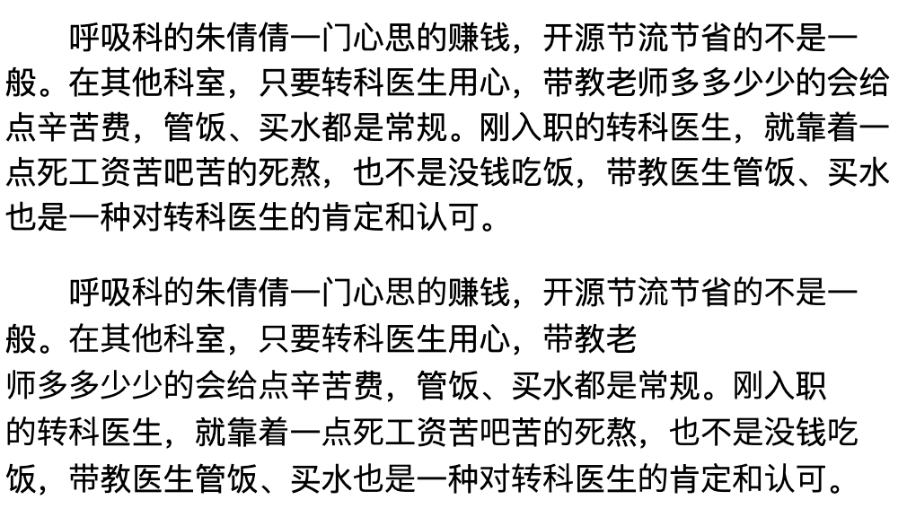

# fontsubset

为什么要写这个，主要出发点是阅文文字内容的反盗版，能一定程度上提高黑产的盗版成本。目前大部分的反盗版的方式是将内容转成图片，但是这个可维护性不太好，比如富文本，或者文字上有交互，对于开发者来说，都比较难处理。

我们调研了很久，觉得字体是个很好的办法，但是汉字的全集很大，我们的办法是挑选使用频率很高的 500 个字作为子集，经过实验，500 个字的思源黑体大小是 72K，并不大。将在子集中的文字转成我们子集的 Unicode 编码，和系统字符的默认 Unicode 不一样，同时加密方法不会暴露在 JS 代码中，极大的提高了安全性。

`fontkit` 提供了两个方法

- `genSubsetFont` - 根据原字体和原文字集和 codePointStart 重新生成一个字体文件，并输出他们之间的关系
- `convert` - 根据映射表把字符串转为『加密』后的字符串

为了规避法律风险，建议用免费开源的思源字体，https://github.com/adobe-fonts/source-han-sans

思源黑体和苹果系统默认的 `PingFangSC-Regular` 字体还有微软雅黑差异并不大，可以看下面的贴图



上面完全是苹果默认字体 `PingFangSC-Regular`，下面是替换了常用 500 个汉字的 `PingFangSC-Regular` 和 `Source-Han-Sans` 的混合版本，单看下面的版本，并不能看出明显的差别。

## genSubsetFont

```javascript
const fontpath = path.resolve('fonts', 'SourceHanSansCN-normal.ttf')
// 常用 500 个字
const source =
  '的一了是我不在人们有来他这上着个地到大里说去子得也和那要下看天时过出小么起你都把好还多没为又可家学只以主会样年想能生同老中从自面前头到它后然走很像见两用她国动进成回什边作对开而已些现山民候经发工向事命给长水几义三声于高正妈手知理眼志点心战二问但身方实吃做叫当住听革打呢真党全才四已所敌之最光产情路分总条白话东席次亲如被花口放儿常西气五第使写军吧文运在果怎定许快明行因别飞外树物活部门无往船望新带队先力完间却站代员机更九您每风级跟笑啊孩万少直意夜比阶连车重便斗马哪化太指变社似士者干石满决百原拿群究各六本思解立河爸村八难早论吗根共让相研今其书坐接应关信觉死步反处记将千找争领或师结块跑谁草越字加脚紧爱等习阵怕月青半火法题建赶位唱海七女任件感准张团屋爷离色脸片科倒睛利世病刚且由送切星晚表够整认响雪流未场该并底深刻平伟忙提确近亮轻讲农古黑告界拉名呀土清阳照办史改历转画造嘴此治北必服雨穿父内识验传业菜爬睡兴'

genSubsetFont({
  source,
  fontpath,
  codePointStart: 10000,
}).then((res) => {
  console.log(res.map)
  fs.writeFileSync('test/subset.ttf', res.buffer)
})
```

## convert

```javascript
// 用上面产出的 res.map 来转换字符串
convert(
  '呼吸科的朱倩倩一门心思的赚钱，开源节流节省的不是一般。在其他科室，只要转科医生用心，带教老师多多少少的会给点辛苦费，管饭、买水都是常规。刚入职的转科医生，就靠着一点死工资苦吧苦的死熬，也不是没钱吃饭，带教医生管饭、买水也是一种对转科医生的肯定和认可。',
  res.map
)
// 结果：呼吸&#10305;&#10290;朱倩倩一门心&#10196;&#10290;赚钱，&#10183;源节&#10264;节省&#10290;&#10006;&#10231;一般。&#10134;&#10069;&#10037;&#10305;室，&#10104;&#10335;&#10359;&#10305;医生用心，&#10173;教老&#10172;&#10143;&#10143;&#10167;&#10167;&#10290;&#10043;&#10317;&#10270;辛苦费，管饭、买水&#10373;&#10231;&#10175;规。&#10080;入职&#10290;&#10359;&#10305;医生，就靠&#10296;一&#10270;&#10253;工资苦&#10115;苦&#10290;&#10253;熬，&#10020;&#10006;&#10231;&#10259;钱&#10108;饭，&#10173;教医生管饭、买水&#10020;&#10231;一种&#10164;&#10359;&#10305;医生&#10290;肯&#10161;&#10122;&#10339;&#10106;。
```

## 如何在浏览器中使用

可以参考代码库中的 `test/index.html`

```html
<style>
  .font2 {
    font-family: 'source-han-sans', 'Microsoft Yahei', PingFangSC-Regular,
      HelveticaNeue-Light, 'Helvetica Neue Light', sans-serif;
  }
  @font-face {
    font-family: source-han-sans;
    src: url(./subset.ttf);
  }
</style>
```
